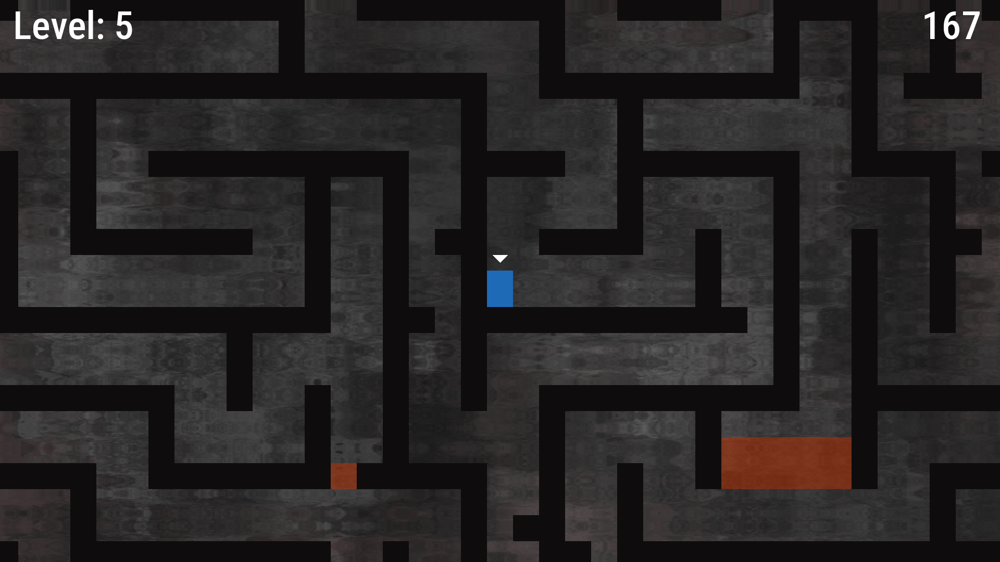

# Thomas Was Late SFML 3
 This is the 4th game from *Beginning C++ Game Programming* by John Horton which I have implemented. As with the previous ones, I ported the game to SFML v3.0.2 and made some changes to the code.
 
 Thomas Was Late is a platform game where the player takes control of two characters (Thomas and Bob, which are simple rectangle shapes) and uses their particular jumping skills to reach the level's goal. If both characters reach the goal in time they win that level and are taken to the next one, else they are automatically taken to the next level when the time left is zero. Two players can play the game in split screen mode. 
 
 
 | Controls              | Action                                             | 
 |:----------------------|:---------------------------------------------------|
 | F1                    | switch between split screen and full screen modes  |
 | F2                    | switch focus between the characters                |
 | W, A, D               | Thomas' movement                                   |
 | Up, Left, Right keys  | Bob's movement                                     |
 | Enter                 | starts each level                                  |
 | Escape                | quit the game                                      |
 
 

### Engineering Improvements Over the Original Implementation

- Porting to SFML v3.0.2
- Added a new custom level
- Refactored randomness into a dedicated utility class
- Fixed the next_level() bug caused by trailing empty lines in .txt files
 

### How it looks



### Gameplay Video
(working on it)

### Project Goals

- Gain experience OOP C++ Programming.
- Adapt legacy code to a newer version of SFML.
- Build a complete, finished game from scratch.

### What I learned

- Designed interacting game entities using inheritance hierarchies
- Implemented polymorphic behavior for playable characters
- Managed resource lifetimes and ownership across game systems
- Parsed text-based level descriptions into runtime geometry
- Integrated OpenGL shaders through SFML
- Implemented basic particle system architecture


### Technologies
- C++
- SFML 3.0.2
- Kate
- Clang
- Linux
- Krita
- Arch Linux

### How to Build and Run
Assuming you are on Arch Linux, make sure you have SFML and clang installed:

- To check: ```pacman -Q | grep -e "sfml" -e "clang"```
- To install: ```sudo pacman -S sfml clang```

Download the .zip, extract it, then *cd* into the project directory. Now use the command below to compile:

```clang++ *.cpp -o thomas -lsfml-graphics -lsfml-window -lsfml-system -lsfml-audio```

To run the game: ```./thomas```

### Credits
- John Horton's book Beginning C++ Game Programming
- Krita project: https://krita.org 
- Kate: https://kate-editor.org

### License
GPLv2
